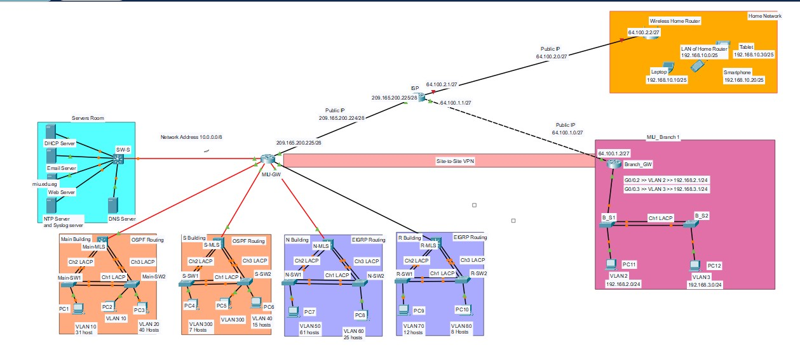
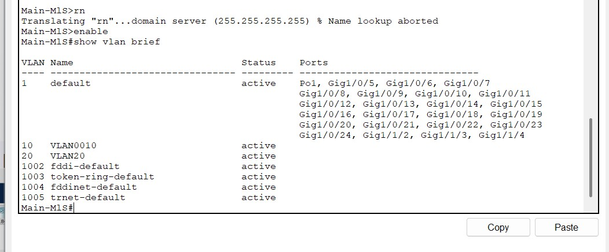
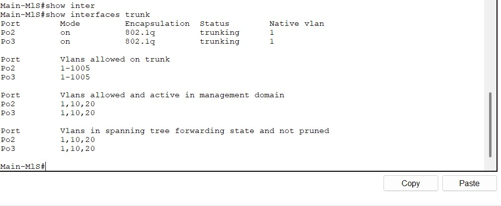
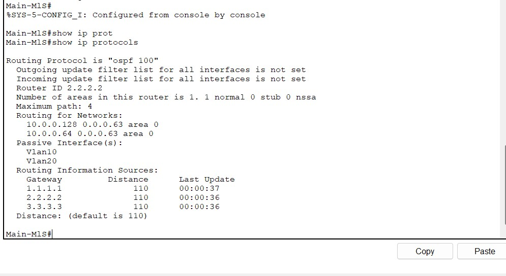
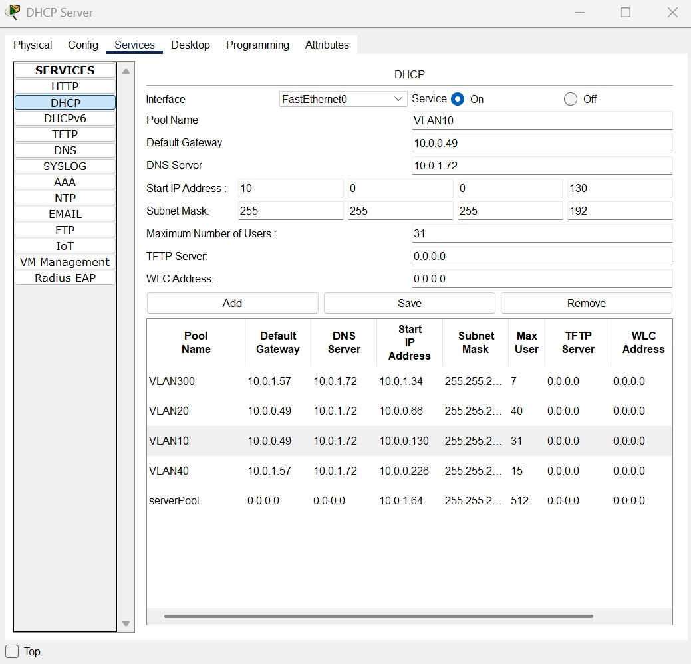
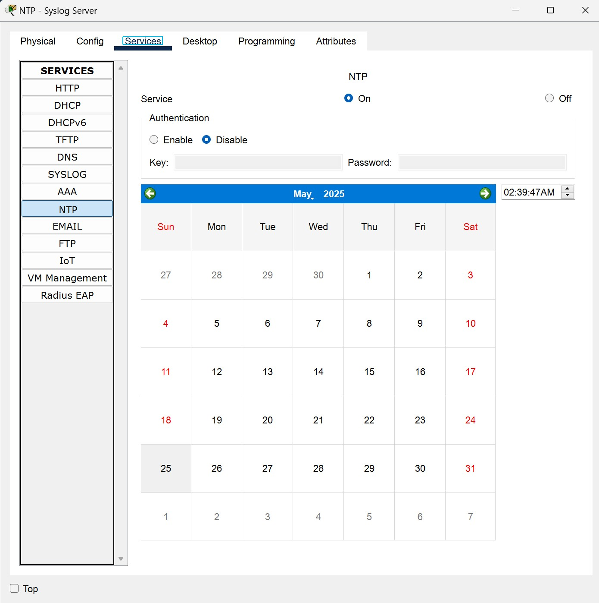
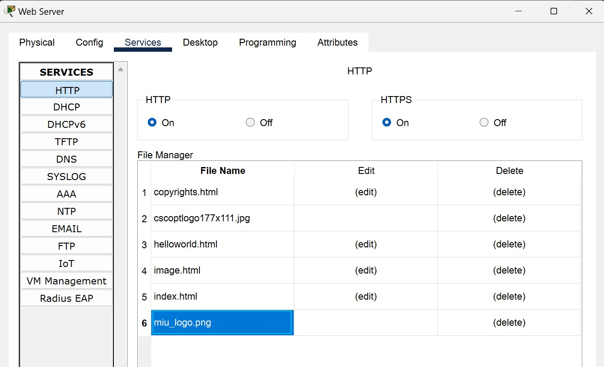
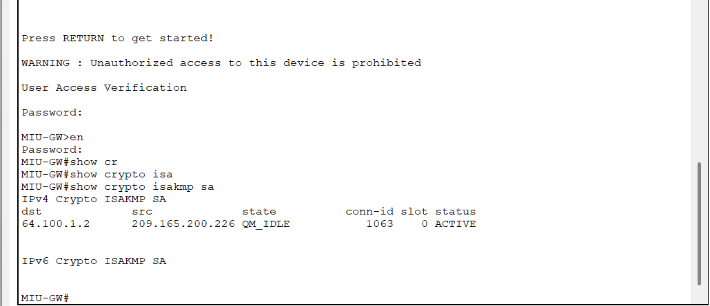
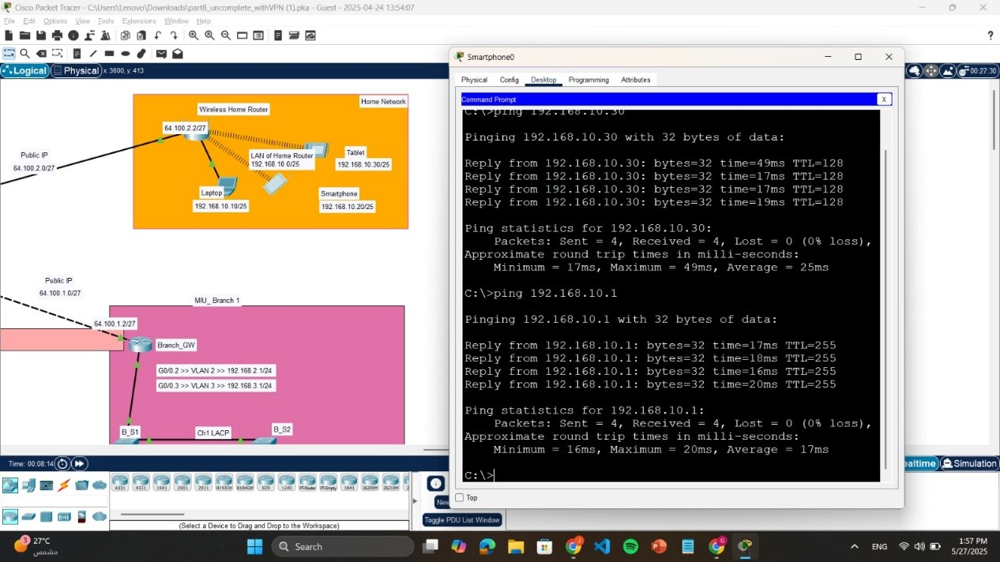

# 🌐 MIU Campus Area Network (CAN)

## 📌 Overview
This project implements a **Campus Area Network (CAN)** for Misr International University (MIU) using Cisco Packet Tracer.

It simulates a real-world enterprise network integrating routing, switching, security, and network services across multiple buildings and a branch network.

---

## 🧱 Network Architecture
- Multi-building campus network (Main, S, N, R)
- Branch network connected via WAN
- Central gateway (MIU-GW)
- Wireless home network integration

---

## 🚀 Features Implemented

### 🔹 Addressing & Design
- VLSM subnetting (10.0.0.0/8)
- VLAN-based segmentation
- Efficient IP allocation per department

### 🔹 Switching
- VLAN configuration
- Trunking (802.1Q)
- Inter-VLAN Routing (SVI)
- EtherChannel (LACP)

### 🔹 Routing
- OSPF (Main & S buildings)
- EIGRP (N & R buildings)
- Dynamic routing between all networks

### 🔹 Network Services
- DHCP (central server + router pools)
- DNS Server
- Web Server (HTTP)
- Email Server (SMTP/POP3)

### 🔹 Security & WAN
- Site-to-Site IPsec VPN
- NAT & PAT
- Static NAT for internal servers

### 🔹 Network Management
- NTP (time synchronization)
- Syslog logging
- SSH secure access

### 🔹 Wireless
- WPA2-secured wireless home network
- Multi-device connectivity

---

## 🛠️ Tools Used
- Cisco Packet Tracer
- Routing Protocols: OSPF, EIGRP
- Networking Services: DHCP, NAT, DNS, VPN

---

## 📸 Screenshots

### 🔹 Network Topology

---

### 🔹 VLAN Configuration

---

### 🔹 Trunk Configuration

---

### 🔹 EtherChannel

---

### 🔹 Routing Protocols (OSPF / EIGRP)

---

### 🔹 DHCP Configuration

---

### 🔹 NTP Configuration

---

### 🔹 Web Server Configuration

---

### 🔹 VPN Configuration

---

### 🔹 Wireless Home Network

